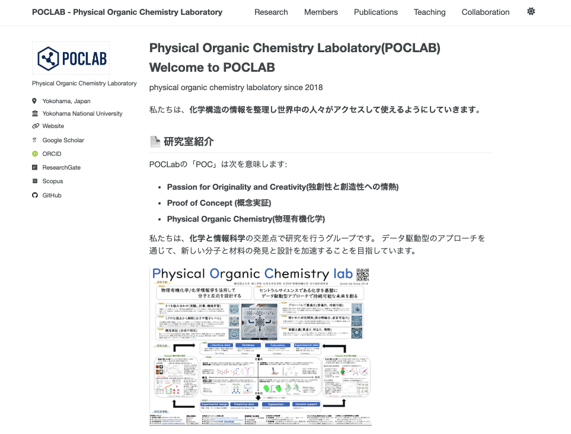

# POCLAB研究室ホームページ

横浜国立大学 理工学部 化学・生命系学科 五東研究室 POCLAB（Precision Organic Chemistry Laboratory）Webサイトです。



## 🌐 公開URL

https://poclab-web.github.io/homepage/

## 📋 更新内容

このサイトでは主に以下の2つのセクションを更新します：

### 🔬 研究プロジェクト（Portfolio）

- **場所**: `_portfolio/` ディレクトリ
- **内容**: 研究テーマ、研究成果、進行中のプロジェクト

### 👥 メンバー情報

- **場所**: `_members/` ディレクトリ  
- **内容**: 教員、大学院生、学部生のプロフィール

詳しい更新方法は **[HOWTOUSE.md](HOWTOUSE.md)** をご覧ください。

## 🚀 ローカル環境でのプレビュー

サイトをローカルでプレビューするための基本的な手順です。

### 前提条件のインストール

#### macOSの場合

**1. Homebrewのインストール（未インストールの場合）**
```bash
/bin/bash -c "$(curl -fsSL https://raw.githubusercontent.com/Homebrew/install/HEAD/install.sh)"
```

**2. rbenv（Ruby管理ツール）のインストール**
```bash
brew install rbenv ruby-build
echo 'eval "$(rbenv init -)"' >> ~/.zshrc
source ~/.zshrc
```

**3. Rubyのインストール**
```bash
rbenv install 3.3.9
rbenv global 3.3.9
ruby -v  # バージョン確認
```

**4. Bundlerのインストール**
```bash
gem install bundler
```

### クイックスタート

```bash
# 1. 依存関係をインストール
bundle config set --local path 'vendor/bundle'
bundle install

# 2. ローカルサーバーを起動
bundle exec jekyll serve --port 4000 --host localhost
```

ブラウザで `http://localhost:4000` にアクセスしてサイトを確認できます。

### トラブルシューティング

**権限エラーが発生する場合:**
```bash
rm -f Gemfile.lock
bundle install
```

**ポートが使用中の場合:**
```bash
bundle exec jekyll serve --port 4001 --host localhost
```

詳細なセットアップ手順は [HOWTOUSE.md](HOWTOUSE.md) をご覧ください。

## 🔄 更新ワークフロー

1. **ファイルを編集** (研究プロジェクトやメンバー情報)
2. **ローカルでプレビュー確認** (変更は自動的に反映されます)
3. **GitHubにプッシュ**
4. **GitHub Pagesで自動公開**

## 📚 詳細な使用方法

具体的な更新方法については **[HOWTOUSE.md](HOWTOUSE.md)** で詳しく説明しています：

- 研究プロジェクトの追加・更新方法
- メンバー情報の管理方法
- 学年進行時の更新手順
- トラブルシューティング

## 🛠️ 技術情報

- **基盤**: [Academic Pages](https://academicpages.github.io/) テンプレートをカスタマイズ
- **静的サイトジェネレーター**: Jekyll
- **ホスティング**: GitHub Pages
- **ライセンス**: MIT License

---

**最終更新**: 2025/12/01 
**管理者**: POCLAB
