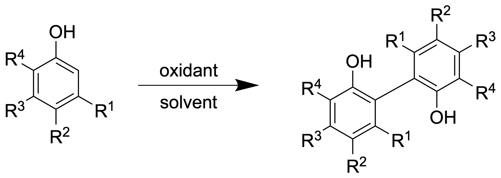

## プロジェクト概要
有機合成化学において機械学習等のデータ駆動的アプローチを適用し、反応最適化や目的物の収率予測を試みた先行研究は多く存在する。私たちは、既存手法の課題に基づき、有機合成を効率化する新たなデータ駆動的アプローチを模索している。
新規アプローチを試験するため、私たちはテーマ反応としてフェノールの酸化的ホモカップリングを選んだ。選択背景は以下の通りである。

(1) 目的物のビフェノール類は生理活性分子を多く含む有用な化合物群であること。

(2) ビフェノール類は市販試薬が少なく、入手には合成が不可欠であること。

(3) 一段階反応であるため、ビフェノール類を簡便に合成できる反応であること。

(4) 基質適用範囲の異なる様々な反応条件が報告されており、盛んに研究されている反応であること。

私たちは酸化的ホモカップリングにおいて、特定反応条件下における基質（フェノール分子）の反応性を **Positive and Unlabeled Machine Learning (PU learning)** という機械学習手法を用いて予測を試みた（研究テーマ１）。また、報告されている反応条件の基質適用範囲を定量化する手法を提案した（研究テーマ２）。

 

## 研究内容

### :bullseye: **主要な研究テーマ**

#### 1. **PU learning を用いた反応予測**
特定反応条件下における基質の反応性を、機械学習により予測することは、成果の見込まれにくい実験の回避に繋がり、時間的・経済的コストの削減を導くと考えられる。しかし、先行研究で報告される反応条件はネガティブデータ（反応しない基質）が十分に報告されないという制約がある。私たちは、このような制約下においても分類モデルを構築できる機械学習手法であるPU learningに着目し、本タスクに適用させた。PU learningとはポジティブデータ（ここでは、反応する基質）とアンラベルデータ（ここでは、未実験の基質）からモデルを学習可能な機械学習手法である。学習したモデルで、未実験基質の反応進行可否を予測し、その予測結果と実際の実験結果を比較して手法の有用性を示した。

#### 2. **基質適用範囲の定量的評価**
近年の有機合成化学における反応開発では、論文で反応例として報告される基質の数は増加している。この傾向は、基質の数が反応の有用性を示す指標として用いられ、重視されている現状を反映している。
しかし、基質の数が多くても類似した基質ばかりでは反応の有用性を示すことはできない。重視すべきなのは数ではなく多様性であるが、基質の多様性を定量化する方法は確立されていない。
そこで、本研究では基質の多様性を定量化し、基質の数に代わる新たな反応条件の評価指標をつくることを目的とした。
### 🔬 **実験・計算アプローチ**

#### :abacus: **理論計算手法**
1. **Gaussian 16**: 量子化学計算 (構造最適化, エネルギー計算)
2. **RDKit**: RDKitを用いた特徴量算出
3. **ECFP**: 既存の手法との比較
4. **Python**: 計算自動化プログラムの作成

#### :brain: **機械学習手法**
1. **効率的なデータ収集**: :globe_with_meridians: PubChem, ChEMBL, ChEBI, CAS SciFinder with Python, pandas, RDKit
2. **特徴量エンジニアリング**: 分子記述子の選択・最適化
3. **分類**: Random Forest, Decision Tree, SVM etc.
4. **次元削減**: PCA, UMAP 

#### :alembic: **実験検証**
1. **有機合成**: フェノール類の酸化的カップリングのデータ収集
2. **qNMR**: 目的物の収量測定
3. **予測基質の反応性検証**: 反応が進行すると予測された基質が実際に二量化可能か検証

## 研究成果

### :bar_chart: **達成された成果**

#### 1. **PU learning を用いた反応予測**
- 量子化学計算を用いてフェノール類分子の反応性を表現
- PU learning を用いることで、負例が入手不可能な実験データから反応性を予測することに成功

#### 2. **基質適用範囲の定量的評価**
- 基質適用範囲を基質の多様性の観点から定量化 :eyes:
- 反応条件の特徴を捉える評価指標を新たに定義 :magic_wand:

### :speaker_high_volume: **学会発表**
- 一澤 要守, 西井 崇文, 五東 弘昭. フェノール類の酸化的カップリングにおける基質適用範囲の評価. [日本コンピュータ化学会2025年春季年会](https://www.sccj.net/events/nenkai/2025sp/program.html), 2025.6.6, 東京, 2P17.
- 西井 崇文, 一澤 要守, 長野 遥, 向井 裕哉, 坂口 大門, 五東 弘昭. PU Learningを用いたフェノールの酸化的ホモカップリングにおける反応性予測. [第19回日本ケミカルバイオロジー学会](https://jscb.jp/annual-meeting/outline/), 2025.6.5-6, 京都, P-049.
- 西井 崇文, 一澤 要守, 長野 遥, 坂口 大門, 五東 弘昭. PUラーニングを用いたフェノールの酸化的ホモカップリングにおける反応条件の基質適用範囲の予測と解釈. [第47回ケモインフォマティクス討論会](https://sites.google.com/view/chemoinfo2024/ホーム), 2024.12.17, 金沢, P03.
- 西井 崇文, 一澤 要守, 長野 遥, 坂口 大門, 五東 弘昭. PUラーニングを用いたフェノールの酸化的ホモカップリングにおける反応条件の基質適用範囲の予測と解釈. [第14回 CSJ化学フェスタ2024](https://festa.csj.jp/2024/), 2024.10.23, 東京, P4-040.
- 一澤 要守, 西井 崇文, 長野 遥, 坂口 大門, 五東 弘昭. フェノール類の酸化的カップリングにおける反応条件の基質適用範囲の評価と予測. [日本コンピュータ化学会2024年秋季年会](https://touche-np.org/sccj), 2024.10.20, 室蘭, P108.

### :page_facing_up: **論文**
- Nishii, T; Ichizawa, K; Nagano, H; Mukai, H; Sakaguchi, D; Gotoh, H. Predicting Substrate Reactivity in Oxidative Homocoupling of Phenols using Positive and Unlabeled Machine Learning. 2025年投稿予定.

## 今後の展開

### :rocket: **次のステップ**

1. **その他の反応系への応用**:
2. **分子特性予測と反応性予測の融合**: 有用な特性を持つ分子の予測とそれらの合成可能性の予測を組み合わせ、さらに効率的な実験が可能になる。
3. **PNU learning を用いた機械学習モデルの構築**: 負例(Negative)データも活用した反応予測法の開発、より明確な基質適用範囲の予測が期待される。
